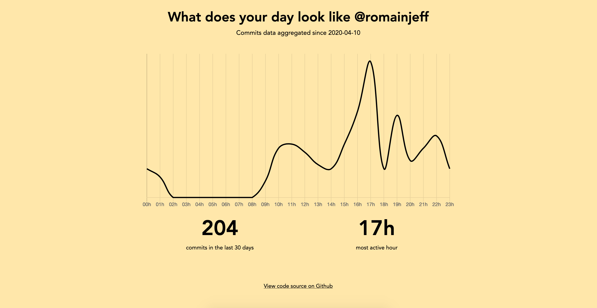

## Github Activity
Inspired from spotify.me recap... checkout how your day looks like since the last 30 days !



## How to run ?
First you need to create the `.env`
```bash
cp .env.dist .env
```

- You need to generate a token on your github account. (https://github.com/settings/tokens)
- Then you can put it in the `.env` along with your github @

Now you can launch the stack
```bash
docker-compose up -d
```

Go to https://localhost:8000 for the result !

Important to note: Github API only allows 30calls/minute... (and limit results to 100 per page)
